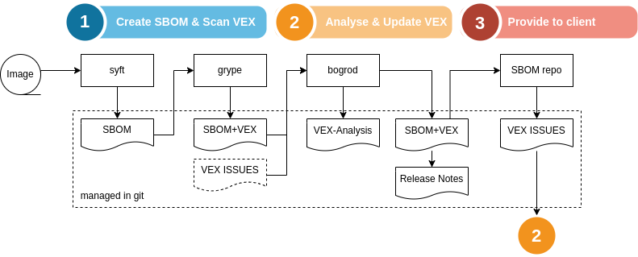

Bogrod
======

Create and manage vulnerabilities analysis (VEX/SBOM) in cyclonedx format.

Features
--------

* Analyse and update VEX analysis interactively by component and severity
* Report on vulnerabilities by severity in detailed or summary form
* Collect VEX information from multiple SBOMs in cyclonedx format
* Create a git-managed database of vulnerabilities (yaml format)
* Update release notes with vulnerabilities found in SBOMs

Syntax
------

Run as a command line utility:

    usage: bogrod [-h] [-n NOTES] [-o OUTPUT] [-S] [-s SEVERITIES] [-x] [--vex-file VEX_FILE] [-p SBOM_PROPERTIES] [-m] [-w] [-W] [-g GRYPE] sbom

    positional arguments:
      sbom                  /path/to/cyclonedx-sbom.json
    
    optional arguments:
      -h, --help            show this help message and exit
      -n NOTES, --notes NOTES
                            /path/to/notes.yaml
      -o OUTPUT, --output OUTPUT
                            output format [table,json,yaml,raw]
      -S, --summary         summarize report
      -s SEVERITIES, --severities SEVERITIES
                            list of serverities in critical,high,medium,low
      -x, --update-vex      update vex information from sbom vulnerabilities
      --vex-file VEX_FILE   /path/to/vex.yaml
      -p SBOM_PROPERTIES, --sbom-properties SBOM_PROPERTIES
                            Merge sbom with information in /path/to/properties.yaml
      -m, --merge-vex       Merge vex data back to sbom
      -w, --write-notes     update notes according to sbom (add new, mark fixed)
      -W, --work            work each vulnerability
      -g GRYPE, --grype GRYPE

Example workflow
----------------

We have a docker image, jupter/base-notebook:ubuntu-20.04, for which we want to 
analyze and keep track of vulnerabilities. We will use syft to create the
SBOM and grype to find all vulnerabilities. Next we will use bogrod to analyze
each vulnerabilitiy, record our analysis and update the SBOM with the respective
VEX analysis information.

1. Create SBOM using syft

        $ syft jupyter/base-notebook:ubuntu-20.04 --file releasenotes/sbom/jupyter-base-notebook.syft.json --output json

2. Find VEX information

        # we output two grype reports 
        # -- this first report includes detailed VEX information
        $ grype sbom:releasenotes/sbom/jupyter-base-notebook.syft.json --file releasenotes/sbom/jupyter-base-notebook.grype.json --output json
        # -- the second report is restricted to cylconedx format 
        $ grype sbom:releasenotes/sbom/jupyter-base-notebook.syft.json --file releasenotes/sbom/jupyter-base-notebook.cdx.json --output embedded-cyclonedx-vex-json

3. Use bogrod to analyze each vulnerability interactively

        # -- bogrod automatically uses the .grype report to provide additional information for each vulnerability 
        $ bogrod --work -S releasenotes/sbom/jupyter-base-notebook.cdx.json --vex-file releasenotes/sbom/vex.yaml --update-vex --merge-vex 

Note that bogrod will automatically find the .vex and .grype files corresponding to the .cdx file,
if these are not specified.

Working with vulnerabilities
----------------------------

Bogrod can work interactively with vulnerabilities found in a SBOM by specifying
the -W command line option. This will present a list of the vulnerabilities found
so that you can select and analyze each one in turn. 

    $ bogrod jupyter -W

    Select 1

    Save analysis and quit

Working with multiple images
----------------------------

Sometimes we may have the artefacts built from the same source image and thus
find similar vulnerabilities. It would be a waste of time to keep analysing the
same vulnerability multiple times. Therefore we can combine bogrod's vex information
(a yaml file) for multiple images, while bogrod keeps track of where each 
vulnerabillity came from.

To simplify this process, create a .bogrod file that references each image's
SBOM file:

        [jupyter]
        sbom=releasenotes/sbom/jupyter-base-notebook.json
        update_vex=yes
        merge_vex=yes
        
        [jupyter-hub]
        sbom=releasenotes/sbom/jupyter-hub-notebook.json
        update_vex=yes
        merge_vex=yes

In order to specify bogrod's command line options for all images, use a global
section:

        [global]
        update_vex=yes
        merge_vex=yes

        [jupyter]
        sbom=releasenotes/sbom/jupyter-base-notebook.json
        
        [jupyter-hub]
        sbom=releasenotes/sbom/jupyter-hub-notebook.json
        

Vulnerability Exploit information (VEX)
---------------------------------------

Bogrod can extract vulnerability exploit information from 
the release notes or from a vex.yaml file (--vex-file)::

    # vex.yaml
    CVE-2022-999999:
        state: open
        response: will fix in next release     
        detail: affects only if debug flag is set
        justification: in normal operation this is not an issue

The vex.yaml file is used to update the "analysis" part of the 
CycloneDX sbom when the -x flag is specified. If --vex-file is
not specified the information from the security section in the
notes is used to set the analysis 'state' and 'response' fields.

In addition to VEX analysis information, bogrod will keep track
of the source(s), and you may be keep additional information by
providing more details:

  # vex.yaml
  CVE-2022-999999:
    ...
    related:
    - component: jupyter/base-notebook:ubuntu-20.04
    - duplicates: CVE-2019-10773

Release Notes Format
--------------------

The release notes format is simply a YAML file with a
security section:

    # notes.yaml
    # security:
    #  - <CVE#> severity status [comment]
    security:
    - CVE-2022-999999 high open will fix in next release 
    - CVE-2022-999989 high fixed will fix in next release

This is a superset of the release notes format used by reno, the
release notes tools.

Pipeline with grype and reno
----------------------------

1. reno => create release notes
2. grype => scan image and create sbom
3. bogrod => update release notes with vulns found in sbom
4. reno report => build release notes  

Tools
-----

* Syft https://github.com/anchore/syft
* Grype https://github.com/anchore/grype
* Trivy https://aquasecurity.github.io/trivy/
* SBOM diff https://github.com/CycloneDX/cyclonedx-cli 
* Reno https://docs.openstack.org/reno/latest/

Python

* pip install mitrecve - MITRE vuln database queries (https://mitrecve.readthedocs.io/en/latest/)
* pip install nvdlib - NIST vuln database queries (https://nvdlib.com/en/latest/)

Usage of Syft and Grype:

- Syft can output a detailed json report with all artificats found inside and image.
  This json follows a Syft internal schema, and it can be used by Grype as input to
  create a CycloneDX SBOM. 
- Bogrod can accept a Syft json report as input to have more information when working
  on resolving vulnerabilities.

Specification
-------------

* browser https://cyclonedx.org/docs/1.4/json/
* jsonschema https://github.com/CycloneDX/specification/releases

What's in a name?
-----------------

I was looking for the name of a trusted secret keeper of sorts. A fan of Harry Potter's
I found some character from Gringotts Wizarding Bank would be a great fit.

*Wikipedia* has this to say about Bogrod:

Bogrod, a goblin, is one of the counter staff (what would be tellers in a Muggle bank) at Gringotts Wizarding Bank in Diagon Alley.

Source: https://en.wikibooks.org/wiki/Muggles%27_Guide_to_Harry_Potter/Characters/Bogrod
Image by: Eliedion, CC BY-SA 4.0 https://commons.wikimedia.org/wiki/File:Audio-animatronic_of_Harry_Potter_and_the_Escape_from_Gringotts.JPG"><img width="64" alt="Audio-animatronic of Harry Potter and the Escape from Gringotts" src="https://upload.wikimedia.org/wikipedia/commons/thumb/7/7b/Audio-animatronic_of_Harry_Potter_and_the_Escape_from_Gringotts.JPG/64px-Audio-animatronic_of_Harry_Potter_and_the_Escape_from_Gringotts.JPG
