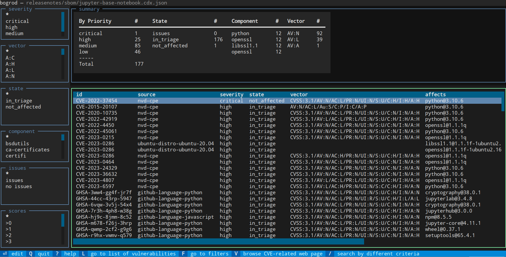
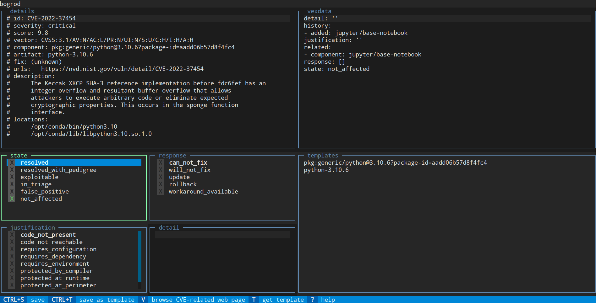

<picture align="center">
  <source srcset="https://raw.githubusercontent.com/productaize/bogrod/master/resources/logotitle.png">
  
</picture>

bogrod
======

Manage vulnerabilities SBOM and VEX analysis like source code.

Why?
----

SBOMs are typically managed in UI tools like Dependency Track. While providing
a nice UI, these tools require additional infrastructure and are far removed
from the development process. The last thing your DevOps team needs is another
external tool that it needs to manage and integrate with its CICD practices.

Enter bogrod.

* enable your DevOps team to manage SBOM where it originates: with the code
* track SBOM and your VEX analysis using established git practices
* analyze vulnerabilities and update VEX analysis from the console or in your favorite IDE
* easily reuse VEX analysis across multiple images

Features
--------

* Analyse and update VEX analysis interactively by component and severity
* Report on vulnerabilities by severity in detailed or summary form
* Collect VEX information from multiple SBOMs in cyclonedx format
* Create a git-managed database of vulnerabilities (yaml format)
* Update release notes with vulnerabilities found in SBOMs
* Update SBOM metadata from a common source

Installation
------------

Install bogrod from pypi, in your Python venv:

        $ pip install bogrod

Alternatively, to install from source, including examples and tests, clone the repository and install it using pip:

        $ git clone https://github.com/productaize/bogrod.git 
        $ pip install ./bogrod

Syntax
------

Run as a command line utility:

    usage: bogrod [-h] [-n NOTES] [-o OUTPUT] [-S] [-s SEVERITIES] [-x] [--vex-file VEX_FILE] [-p SBOM_PROPERTIES] [-m] [-w] [-W] [-g GRYPE] sbom

    positional arguments:
      sbom                  name of sbom in .bogrod, or /path/to/cyclonedx-sbom.json
    
    optional arguments:
      -h, --help            show this help message and exit
      -n NOTES, --notes NOTES
                            /path/to/notes.yaml
      -o OUTPUT, --output OUTPUT
                            output format [table,json,yaml,raw]
      -S, --summary         summarize report
      -s SEVERITIES, --severities SEVERITIES
                            list of serverities in critical,high,medium,low
      -x, --update-vex      update vex information from sbom vulnerabilities
      --vex-file VEX_FILE   /path/to/vex.yaml
      -p SBOM_PROPERTIES, --sbom-properties SBOM_PROPERTIES
                            Merge sbom with information in /path/to/properties.yaml
      -m, --merge-vex       Merge vex data back to sbom
      -w, --write-notes     update notes according to sbom (add new, mark fixed)
      -W, --work            work each vulnerability
      -g GRYPE, --grype GRYPE

Filename conventions
--------------------

bogrod uses the following conventions for filenames. This simplifies finding all related
files to a given SBOM. When giving the path to the SBOM file using the .cdx.json extension,
bogrod will look for the other corresponding files (grype, syft) in the same directory by
replacing .cdx with .grype and .syft, respectively.

    # cylconedx json format
    releasenotes/sbom/<image-name>.cdx.json
    # grype json format
    releasenotes/sbom/<image-name>.grype.json
    # syft json format
    releasenotes/sbom/<image-name>.syft.json
    # vex yaml format
    releasenotes/sbom/vex.yaml

Example workflow
----------------

We have a docker image, jupter/base-notebook:ubuntu-20.04, for which we want to
analyze and keep track of vulnerabilities. We will use syft to create the
SBOM and grype to find all vulnerabilities. Next we will use bogrod to analyze
each vulnerabilitiy, record our analysis and update the SBOM with the respective
VEX analysis information.

1. Create SBOM using syft

        $ syft jupyter/base-notebook:ubuntu-20.04 --file releasenotes/sbom/jupyter-base-notebook.syft.json --output json

2. Find detailed information for each vulnerability

        # we output two grype reports 
        # -- this first report includes detailed VEX information
        $ grype sbom:releasenotes/sbom/jupyter-base-notebook.syft.json --file releasenotes/sbom/jupyter-base-notebook.grype.json --output json
        # -- the second report is restricted to cylconedx format 
        $ grype sbom:releasenotes/sbom/jupyter-base-notebook.syft.json --file releasenotes/sbom/jupyter-base-notebook.cdx.json --output embedded-cyclonedx-vex-json

3. Use bogrod to analyze each vulnerability interactively

        # -- bogrod automatically uses the .grype report to provide additional information for each vulnerability 
        $ bogrod --work -S releasenotes/sbom/jupyter-base-notebook.cdx.json --vex-file releasenotes/sbom/vex.yaml --update-vex --merge-vex 

Note that bogrod will automatically find the related .vex, .cdx, .grype files, if named according to
the conventions described above.

Working with vulnerabilities
----------------------------

Bogrod can work interactively with vulnerabilities found in a SBOM by specifying
the --work line option. This will present a list of the vulnerabilities found
so that you can filter, select and analyze each one in turn.

    $ bogrod --work releasenotes/sbom/jupyter-base-notebook.cdx.json 

* Press Enter to show the details of the vulnerability.
* Press V to show the vulnerability in its related NVD or CVE web page.
* Save analysis and quit by pressing `Ctrl-C` or `Q`.

* Filter the list of vulnerabilites by the various quick criteria on the left by selecting
  one of the listed values. Press `F` and use the `tab` key to cycle through the options.
* Use the `/` key to enter a search term. Search terms are of the form `<column>:<value>`
  where *column* is one of the columns in the table and *value* is the value to search for.

* Edit multiple vulnerabilities at marking related entries using ctrl+space.
* Then select any one of the marked entries to enter your analysis and press
  `Ctrl+S` to save. All marked entries will be updated with the same analysis.

* Select or edit (`enter`) any vulnerability and press `V` to open the respective CVE   
  or NVD page in your browser. This allows for a very smooth workflow because you don't
  have to copy/paste the CVE-# to your browser.

* While editing a vulnerability, store the analysis as a template by pressing `Ctrl+T`.
  This will store the analysis as a template for the component or artifact.
* Apply a template by pressing `T` and selecting the template to apply.
    * For every component analyzed, bogrod automatically creates a template by the name
      of the component, making it easy to apply the same analysis to related vulnerabilities.

* Uploading vulnerabilities to a vulnerabilities management platform, such as [elementaris
  by Essentx](https://github.com/essentxag/elementaris-docu), is straight forward.

  $ bogrod --upload elementaris releasenotes/sbom/jupyter-base-notebook.cdx.json

* The service automatically returns a report based on its own analysis. In case of  
  issues found, the affected vulnerabilities will be marked by including a `*` postfix
  to its state
* Press enter to show the details of the vulnerability and the report from the service.

Working with multiple images
----------------------------

Sometimes we may have the artefacts built from the same source image and thus
find similar vulnerabilities. It would be a waste of time to keep analysing the
same vulnerability multiple times. Therefore, we can combine vex information
stored by bogrod (a yaml file) for multiple images. bogrod keeps track of where each
vulnerabillity came from.

To simplify this process, create a .bogrod file that references each image's
SBOM file:

    # .bogrod
    [jupyter]
    sbom=releasenotes/sbom/jupyter-base-notebook.json
    update_vex=yes
    merge_vex=yes
    
    [jupyter-hub]
    sbom=releasenotes/sbom/jupyter-hub-notebook.json
    update_vex=yes
    merge_vex=yes

In order to specify bogrod's command line options for all images, use a global section:

    # .bogrod
    [global]
    update_vex=yes
    merge_vex=yes

    [jupyter]
    sbom=releasenotes/sbom/jupyter-base-notebook.json
    
    [jupyter-hub]
    sbom=releasenotes/sbom/jupyter-hub-notebook.json

Vulnerability Exploit information (VEX)
---------------------------------------

Bogrod can extract vulnerability exploit information from
the vex.yaml file (--vex-file)::

    # vex.yaml
    CVE-2022-999999:
        state: open
        response: will fix in next release     
        detail: affects only if debug flag is set
        justification: in normal operation this is not an issue

The vex.yaml file is used to update the "analysis" part of the
CycloneDX sbom when the -x flag is specified. If --vex-file is
not specified the information from the security section in the
notes is used to set the analysis 'state' and 'response' fields.

In addition to VEX analysis information, bogrod will keep track
of the source(s), and you may be keep additional information by
providing more details:

      # vex.yaml
      CVE-2022-999999:
        ...
        related:
        - component: jupyter/base-notebook:ubuntu-20.04
        - duplicates: CVE-2019-10773

Using VEX Analysis Templates
----------------------------

In the vex.yaml file you can use templates to avoid having to manually re-enter the
same analysis for multiple vulnerabilities. For example, you can define a response template
by component or artificat, or as a generally applicable template. The templates
are shown in the *Templates* section of the VEX analysis detail screen.

    # vex.yaml
    templates:
      pkg:generic/python@3.10.6?package-id=aadd06b57d8f4fc4:
        detail: 'this is not used in production'
        justification: ''
        match: component
        response: []
        state: in_triage
      python-3.10.6:
        detail: ''
        justification: ''
        match: artifact
        response: []
        state: in_triage
      some template:
        detail: ''
        justification: ''
        match: all
        response: []
        state: in_triage

SBOM Metadata Update
--------------------

bogrod can update the SBOM metadata section from a metadata.yaml file.
All fields will be merged with the final SBOM content just before writing
the file.

    # sbom.metadata.yaml
    # spec: https://cyclonedx.org/docs/1.4/json/#metadata
    metadata:
      supplier:
        name: productaize
        url:
        - https://productaize.io
        contact:
          - name: Jane John
            email: founder@productaize.io

To update the SBOM metadata, specify the --sbom-properties option:

    $ bogrod ... --sbom-properties sbom.metadata.yaml

SBOM component metadata
-----------------------

The SBOM's metadata describes a component. For container images, syft and grype
use the image's name:tag combination as the component's name, and the
image's sha256 as the component's version. For example, we end up with a
component specification like this:

        ...
        "component": {
          "bom-ref": "c001e40278e035d7",
          "type": "container",
          "name": "jupyter/base-notebook:ubuntu-20.04",
          "version": "sha256:21fd9f9e7e6698ca147bcc87dbeecc485379dddeaa6704f78cc6b4e7f97ec9af"
        },
        ...

While technically accurate, this is hardly useful, since the name of the image is
really jupyter/base-notebook, it's version is ubuntu-20.04. Therefore, bogrod
transforms this information into a contained component. This way the information
is preserved and the component is described correctly. Note that bogrod also
strips any repository information contained in the original image name, if any
(e.g. ghcr.io/jupyter/base-notebook:ubuntu-20.04 => jupyter/base-notebook).

        ...
        "component": {
          "bom-ref": "sbom:c001e40278e035d7",
          "type": "container",
          "name": "jupyter/base-notebook",
          "version": "ubuntu-20.04",
          "components": [
            {
              "bom-ref": "c001e40278e035d7",
              "type": "container",
              "name": "jupyter/base-notebook:ubuntu-20.04",
              "version": "sha256:21fd9f9e7e6698ca147bcc87dbeecc485379dddeaa6704f78cc6b4e7f97ec9af"
            }
          ]
        },
        ...

Using bogrod in a CICD pipeline
-------------------------------

To use bogrod in a CICD pipeline, you can use the following steps. This will install and run
grype and syft to create the SBOMs, and then use bogrod to analyze the vulnerabilities. If one
or more vulnerabilities are in state in_triage or exploitable, the pipeline will fail.

    1. Install syft and grype

        curl -sSfL https://raw.githubusercontent.com/anchore/syft/main/install.sh | sh -s -- -b ${HOME}/.local/bin
        curl -sSfL https://raw.githubusercontent.com/anchore/grype/main/install.sh | sh -s -- -b ${HOME}/.local/bin

    2. Create SBOM files 

        syft jupyter/base-notebook:ubuntu-20.04 --output json=releasenotes/sbom/jupyter-base-notebook.syft.json
        grype sbom:releasenotes/sbom/jupyter-base-notebook.syft.json --output json=releasenotes/sbom/jupyter-base-notebook.grype.json
        grype sbom:releasenotes/sbom/jupyter-base-notebook.syft.json --output cyclonedx-json=releasenotes/sbom/jupyter-base-notebook.cdx.json

    3. Call bogrod

        bogrod --fail-on-issues releasenotes/sbom/jupyter-base-notebook.cdx.json

Pipeline with grype and reno
----------------------------

1. syft => scan image and create sbom
2. grype => scan image and create sbom
3. bogrod => update release notes with vulns found in sbom

Tools
-----

* Syft https://github.com/anchore/syft
* Grype https://github.com/anchore/grype
* Trivy https://aquasecurity.github.io/trivy/
* SBOM diff https://github.com/CycloneDX/cyclonedx-cli
* Reno https://docs.openstack.org/reno/latest/

Python

* pip install mitrecve - MITRE vuln database queries (https://mitrecve.readthedocs.io/en/latest/)
* pip install nvdlib - NIST vuln database queries (https://nvdlib.com/en/latest/)

Usage of Syft and Grype:

- Syft can output a detailed json report with all artificats found inside and image.
  This json follows a Syft internal schema, and it can be used by Grype as input to
  create a CycloneDX SBOM.
- Bogrod can accept a Syft json report as input to have more information when working
  on resolving vulnerabilities.

Specification
-------------

* browser https://cyclonedx.org/docs/1.4/json/
* jsonschema https://github.com/CycloneDX/specification/releases

Commercial Support
------------------

Commercial training and support for use of bogrod is available from productaize.
Please contact us at info at productaize.io for more information.

What's in a name?
-----------------

I was looking for the name of a trusted secret keeper of sorts. An early fan of Harry Potter's
I found some character from Gringotts Wizarding Bank would be a great fit. *Wikipedia* has this to say about Bogrod:
*Bogrod, a goblin, is one of the counter staff (what would be tellers in a Muggle bank) at Gringotts Wizarding Bank in
Diagon Alley.*

Credits:

* Wikipedia: https://en.wikibooks.org/wiki/Muggles%27_Guide_to_Harry_Potter/Characters/Bogrod
* Image by: Eliedion, CC BY-SA
  4.0 https://commons.wikimedia.org/wiki/File:Audio-animatronic_of_Harry_Potter_and_the_Escape_from_Gringotts.JPG">